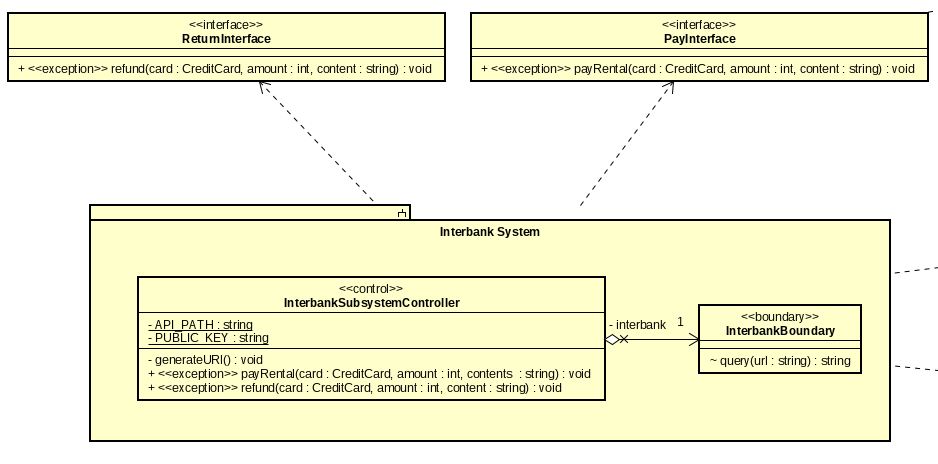

# -TKXDPM.KSTN.20201-05
Trần Đình Hùng  
Nguyễn Văn Huy  
Trương Quang Khánh  
Nguyễn Hồng Quốc Khánh 

## Chỉnh sửa lại thiết kế sau khi báo cáo 

### 1. Category

- Chuyển lớp Category thành abstract và các loại xe sẽ tương ứng với một lớp cụ thể kế thừa Category để có thể dễ thích ứng khi tương lai thêm một category mới vào  

### 2. Interbank Subsystem 

- Phân tách hai hành vi là payRental và refund ra thành từng interface riêng biệt để đảm bảo nguyên lý I.  

### 3. RentedBike

- Chuyển lớp RentedBike có lớp Bike thay vì kế thừa lớp Bike  

### 4. ConnectionFactory 

- Chuyển ConnectionFactory thành interface và MySQLConnectionFactory implement nó (thiết kế giống với Factory Pattern).  

